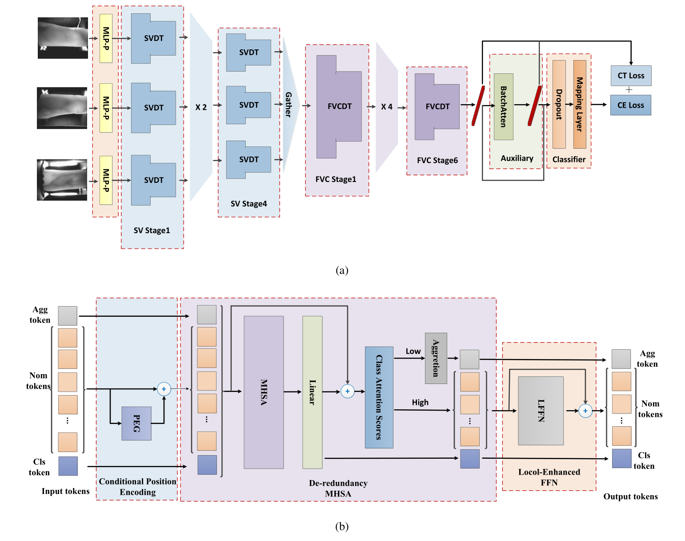
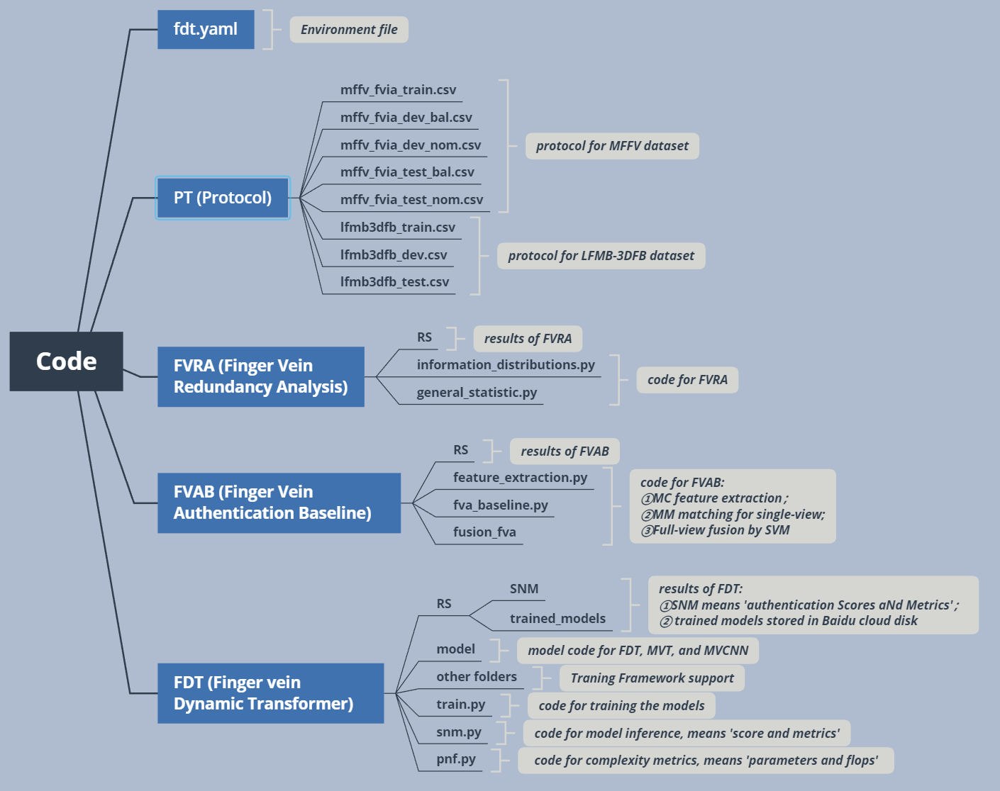

# Code and its usage for reproducing our work FVRA-FDT

## paper: Huang, J., S. Bhattacharjee, S., Marcel, S. and Kang, W.  Study of Full-View Finger Vein Biometrics on Redundancy Analysis and Dynamic Feature Extraction, IEEE Transactions on Information Forensics and Security

## 1. Architecture of FDT model

**Architecture of the FDT model: (a) Overall architecture of FDT; (b) Dynamic Transformer module in FDT.**



## 2. Structure of the code



## 3. E**nvironment install**

- Step 1: cd to the path of fdt.yaml file
- Step 2: use the following command for installing the environment

```bash
conda env create -f fdt.yaml
```

## 4. FVAB baseline (following the MFFV dataset paper)

Note: Here we just conduct the baseline for LFMB-3DFB dataset; The results of MFFV-N dataset are from the MFFV dataset paper 

- Step 1: activate the fdt enviroment (or other bob environment) and cd to path of FVAB
- Step 2: use the following command for feature extraction

```bash
python feature_extraction.py -db /path/of/the/MFFV/dataset/ -fe /path/of/the/feature/you/want/to/save/
```

- Step 3: use the following command for single-view matching

```bash
python fvia.py -db /path/of/the/MFFV/dataset/ -fe /path/of/the/feature/you/had/saved/ -pt /path/of/the/protocols(PT folder)/ -rs RS/
```

- Step 4: use the following command for full-view fusion

```bash
python fusion_fvia.py -rs RS/ -fs RS/ # recommendation: both parameters may point to the same folder (i.e., output folder may be the same as the input folder).
```

## 5. FVRA experiments

- Step1: activate the fdt environment (or other bob environment) and cd to path of FVRA
- Step2: use the following command for single-view and full-view redundancy analysis of one example

```jsx
python information_distribution.py -db /path/of/the/MFFV/dataset/ -rs RS/
```

- Step3: use the following command for general statistically redundancy analysis (all the first sample of the training set)

```jsx
python general_statistic.py -db /path/of/the/MFFV/dataset/ -pt /path/of/the/PT/ -rs RS/
```

## 6. Training the FDT, Ablated FDT, comparison models on MFFV-N dataset

- Step 1: activate the fdt environment and cd to the path of train.py
- Step 2: use the following command for training the FDT

```bash
python train.py -m fdt -d MFFV-N -db /path/to/the/dataset/MFFV-N/ -pt /path/to/the/PT/ -ep 5000 -rs RS/trained_models/fdt_mffv/ 
```

- Step 3: use the following commands for training the Ablated FDT models

```bash
python train.py -m fdt_wo_ba -d MFFV-N -db /path/to/the/dataset/MFFV-N/ -pt /path/to/the/PT/ -ep 5000 -rs RS/trained_models/fdt_wo_ba_mffv/ # without BatchAtten
python train.py -m fdt_wo_lf -d MFFV-N -db /path/to/the/dataset/MFFV-N/ -pt /path/to/the/PT/ -ep 5000 -rs RS/trained_models/fdt_wo_lf_mffv/ # without LFFN
python train.py -m fdt_wo_mp -d MFFV-N -db /path/to/the/dataset/MFFV-N/ -pt /path/to/the/PT/ -ep 5000 -rs RS/trained_models/fdt_wo_mp_mffv/ # without MLP-P
python train.py -m fdt_wo_pe -d MFFV-N -db /path/to/the/dataset/MFFV-N/ -pt /path/to/the/PT/ -ep 5000 -rs RS/trained_models/fdt_wo_pe_mffv/ # without position emebdding
python train.py -m fdt_wo_dr -d MFFV-N -db /path/to/the/dataset/MFFV-N/ -pt /path/to/the/PT/ -ep 5000 -rs RS/trained_models/fdt_wo_dr_mffv/ # without dynamic reduce
```

- Step 4: use the following commands for training the comparison models

```bash
python train.py -m mvcnn_imp -d MFFV-N -db /path/to/the/dataset/MFFV-N/ -pt /path/to/the/PT/ -ep 5000 -rs RS/trained_models/mvcnn_ori_mffv/ # improved MVCNN 
python train.py -m mvt_imp -d MFFV-N -db /path/to/the/dataset/MFFV-N/ -pt /path/to/the/PT/ -ep 5000 -rs RS/trained_models/mvcnn_ori_mffv/ # improved MVT
```

## 7. Training the FDT on LFMB-3DFB dataset

- Step 1: activate the fdt environment
- Step 2: use the following command for training the FDT on LFMB-3DFB dataset

```bash
python train.py -m fdt -d LFMB-3DFB -db /path/to/the/dataset/LFMB-3DFB/LFMB-3DFB_Pictures_Seged_Rectified/ -pt /path/to/the/PT/ -ep 5000 -rs RS/trained_models/fdt_lfmb3dfb/
```

## 8. Obtain the experimental results of all models and save them as ‘.csv’ files

- Step1: use the following command, then you will see all the results of comparison models are saved in RS/SNM/ folder.

```jsx
python snm.py -m ['fdt_mffv', 'mvcnn_ori_mffv_lgpu', 'mvcnn_imp_mffv', 'mvt_ori_mffv', 'mvt_imp_mffv'] -db /path/to/the/dataset/MFFV-N/ -pt /path/to/the/PT/ -rs RS/SNM/ 
```

- Step2: use the following command, the you will see all the results of ablated models are saved in RS/SNM/ folder.

```jsx
python snm.py -m ['fdt_wo_pe_mffv', 'fdt_wo_mp_mffv', 'fdt_wo_lf_mffv', 'fdt_wo_dr_mffv', 'fdt_wo_ba_mffv'] -db /path/to/the/dataset/MFFV-N/ -pt /path/to/the/PT/ -rs RS/SNM/ 
```

## 9. Obtain the experiments results of complexity and save them as ‘.txt’ files

- Just use the following command, then you will see all the results of the complexity experiment are saved in RS/params_flops/ folder.

```jsx
python pnf.py -rs RS/params_flops/
```

## 10. Trained models

- Since all the experiments are conducted on idiap's computer, I did not re-run them when writing this readme.
- All the trained models can be download via Baidu cloud disk:  [https://pan.baidu.com/s/1rrGUjeoL5QheTPCkt9vmuQ?pwd=tifs](https://pan.baidu.com/s/1rrGUjeoL5QheTPCkt9vmuQ?pwd=tifs)

## 11. Contact and collaboration

If you find this work helpful to you and want to collaborate with me, please contact me (Junduan Huang) via Email: runrunjun@163.com.

## 12. Warning: **Note About the License:**

All files made available in this repository is released under the BSD.3 license, which is described in the file LICENSE.txt .

## 13. Dataset
1. MFFV-N dataset:
- Paper: https://ieeexplore.ieee.org/document/10741574
- Repository: https://github.com/SCUT-BIP-Lab/MFFV
2. LFMB-3DFB dataset:
- Paper: https://ieeexplore.ieee.org/document/9484369, and https://ieeexplore.ieee.org/document/9795663/
- Repository: https://github.com/SCUT-BIP-Lab/LFMB-3DFB

## 14. Citation
@ARTICLE{11236466,
  author={Huang, Junduan and Bhattacharjee, Sushil and Marcel, Sébastien and Kang, Wenxiong},
  journal={IEEE Transactions on Information Forensics and Security}, 
  title={Study of Full-View Finger Vein Biometrics on Redundancy Analysis and Dynamic Feature Extraction}, 
  year={2025(Early Access)},
  keywords={Biometrics;Redundancy;Feature extraction;Fingers;Transformers;Imaging;Authentication;Taxonomy;Convolutional neural networks;Cameras;Biometrics;vein recognition;finger vein;full-view;dynamic Transformer},
  doi={10.1109/TIFS.2025.3630891}}